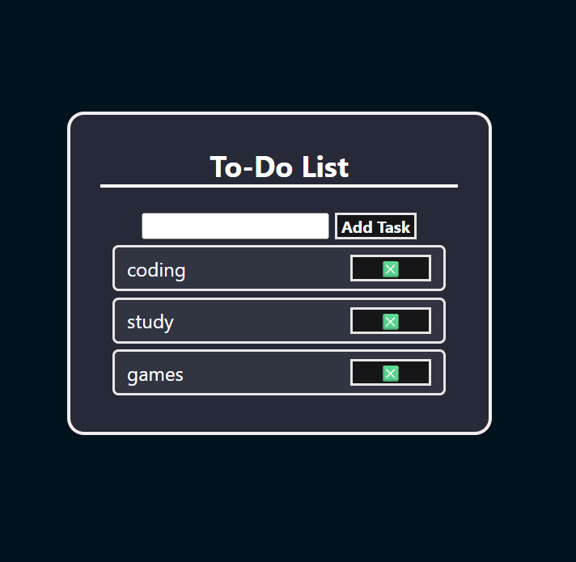

# ✅ To-Do List App

A simple and elegant To-Do List web app built using **HTML**, **CSS**, and **JavaScript**. It helps you manage your daily tasks with ease and stay organized like a pro 💼

---

## 📸 Screenshot



---

## 🚀 Live Demo

👉https://sumitjangid2446.github.io/to-do-list/

---

## 🛠 Tech Stack

- 🔹 HTML5  
- 🔹 CSS3  
- 🔹 JavaScript (Vanilla)

---

## 🎯 Features

- ✅ Add new tasks  
- ✅ Delete completed tasks  
- ✅ Mark tasks as done  
- ✅ Clean and minimal UI  
- ✅ Data stays until tab is refreshed  
- ✅ Mobile responsive

---

## ⚙️ How to Use

1. Clone the repository  
```bash
git clone https://github.com/yourusername/todo-list.git
🙋‍♂️ Author
Made with ☕ and ❤ by Sumit Jangid ....
💻 GitHub: @sumitjangid2446
📨 email :- sumitjangid2446@gmail.com
